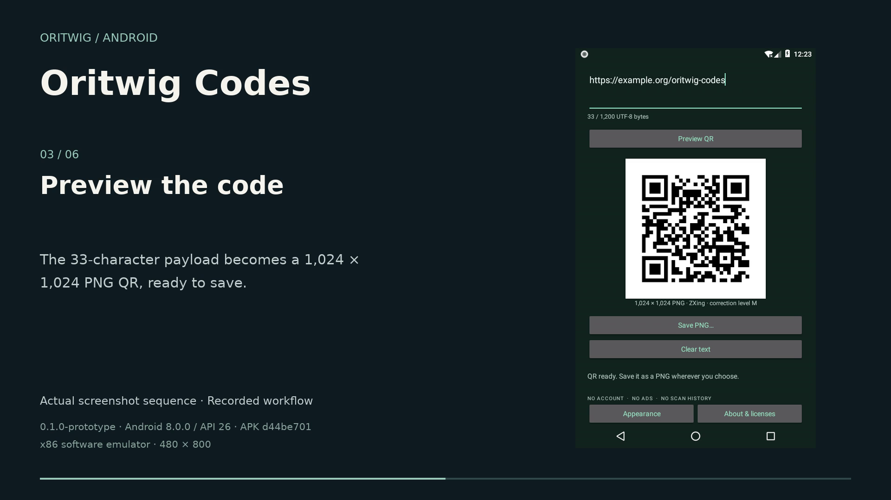
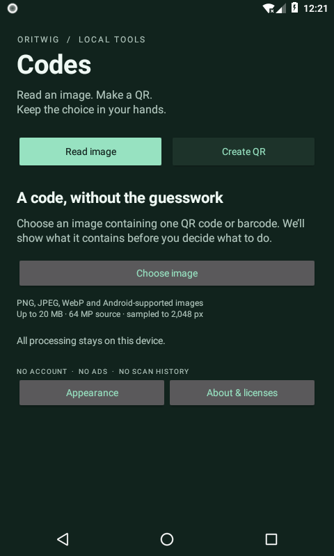
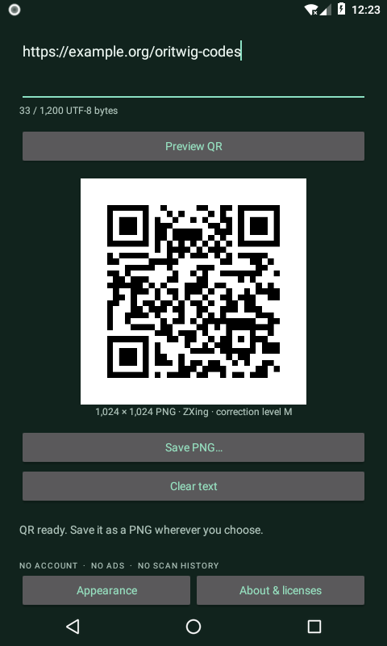
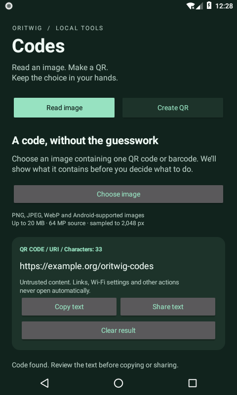

# Oritwig Codes

A small, independent Android image-code reader and QR maker, powered by the
complete **ZXing core 3.5.4** source. It reads a chosen image, shows the decoded
payload, and lets you copy/share it. It also turns text into a QR preview and
saves a PNG through Android's system file picker.

**Prototype, not a published release.** No Telegram account, login, API, server,
network permission, camera permission, scan database or ads. Live camera scanning
is not included. The app never automatically opens a decoded URL or action.

ZXing is the third-party library Telegram uses; it is not Telegram-authored.
See [exact source lineage and adapter boundaries](docs/PROVENANCE.md).

## See it running

[](docs/media/demo.mp4)

[Watch the 50-second demo (MP4, 181 KB)](docs/media/demo.mp4) · [Media provenance](docs/media/manifest.json)

The edit uses actual final-build recording excerpts and later full-screen Android
screenshots: type a payload, generate a QR, export its PNG through Android Files,
re-import that exact file, and inspect the unchanged decoded text. It is an edited
demonstration, not a continuous recording. Input is an existing image; live camera
scanning is not implemented.

### Full-screen captures

Open any image to view its original 480 × 800 capture.

<a href="docs/media/screenshots/gallery-01.png"></a> <a href="docs/media/screenshots/gallery-02.png"></a> <a href="docs/media/screenshots/gallery-05.png"></a>

[Android save picker](docs/media/screenshots/gallery-03.png) · [Exported PNG in the image picker](docs/media/screenshots/gallery-04.png)

Captured from `0.1.0-prototype` on an Android API26 x86 software emulator. The
exported PNG was independently verified as 1,024 × 1,024 pixels with the exact
33-character payload `https://example.org/oritwig-codes`. The [manifest](docs/media/manifest.json)
records the final APK SHA-256, frozen source-input hash, unchanged ZXing 3.5.4 pin,
capture hashes and selected recording ranges. [Verification scope and limits](docs/QA.md).

Tested source: [`7c5be8c`](https://github.com/athemeroy/oritwig-codes/commit/7c5be8c08b4554cb968679706114232f466cad53).

## Upstream vs Oritwig

- **Upstream:** [ZXing core 3.5.4 at `f651b0a…`](https://github.com/zxing/zxing/tree/f651b0a0375676e47144f73397dddff8868b0e4c/core/src/main). Telegram [pins this version](https://github.com/DrKLO/Telegram/blob/f2908b14133bbffbf7ab04f641ecb5bfaf533242/TMessagesProj/build.gradle#L52) and [uses its QR reader](https://github.com/DrKLO/Telegram/blob/f2908b14133bbffbf7ab04f641ecb5bfaf533242/TMessagesProj/src/main/java/org/telegram/ui/CameraScanActivity.java#L1325-L1344). It is a third-party Telegram dependency, not Telegram-authored code
- **Retained unchanged:** all 239 core source files. ZXing still owns barcode detection/decoding, payload parsing, QR encoding and error correction. Oritwig adds no new decoding algorithm
- **Added here:** a new Android shell, bounded image import, safe text inspection, explicit copy/share, QR preview and system-picker PNG export, cancellation/error states, accessibility labels, light/dark appearance and notices
- **Different scope:** ZXing is a general library; this app exposes one-code image reading and text-to-QR generation. It does not expose every upstream encoder or multi-code discovery. The legacy ZXing Barcode Scanner Android app has camera workflows but [does not support Android 14](https://github.com/zxing/zxing/tree/zxing-3.5.4#readme); it was not forked here. This new API35-targeting shell is image-input-only, with no live camera or history
- **Why use it:** read a code from a screenshot or existing image, inspect its exact text without opening it, or make a portable PNG QR without a camera permission, account or server

## Build independently

Use JDK21, Android SDK35, build-tools35.0.0 and the checked-in Gradle8.11.1 wrapper.
Set `ANDROID_HOME` or create an untracked `local.properties` with `sdk.dir=...`.

```sh
python3 tools/verify-upstream.py
./gradlew --no-daemon :engine:test :app:assembleDebug :app:assembleDebugAndroidTest :app:lintDebug
```

App: `app/build/outputs/apk/debug/app-debug.apk`

Instrumented tests: `app/build/outputs/apk/androidTest/debug/app-debug-androidTest.apk`

```sh
adb install -r app/build/outputs/apk/debug/app-debug.apk
adb install -r app/build/outputs/apk/androidTest/debug/app-debug-androidTest.apk
adb shell am instrument -w dev.oritwig.codes.test/dev.oritwig.codes.CodesInstrumentation
```

GitHub Actions runs the independent build, lint and the 16 JVM tests. The 22
native checks were run separately on the API26 emulator; CI does not claim them.

JVM tests cover roundtrips, Unicode, limits, format parsing, inversion/rotation,
Code128, EAN13 and correction metadata. Native tests additionally cover Android
bitmap/stream/PNG boundaries and activity behavior. Real system-picker UI
acceptance is tracked separately in [QA](docs/QA.md); a prepared test is not a pass.

## Licenses

Apache-2.0. Upstream source headers, LICENSE, NOTICE and AUTHORS are retained in
`vendor/zxing` and bundled in the app's About & licenses screen. This repository
adds a new Android shell and thin platform/build adapters. It does not use the
obsolete ZXing Barcode Scanner app or copy Telegram application code.
